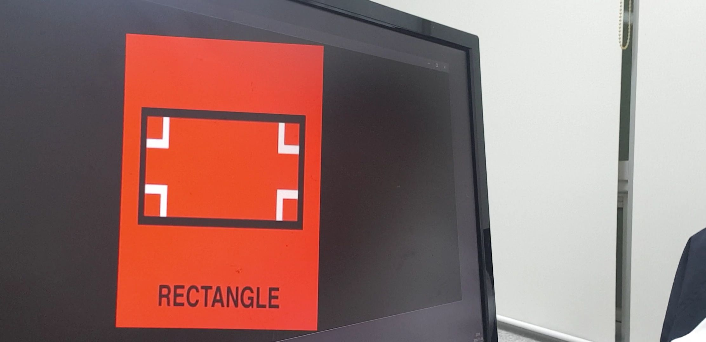
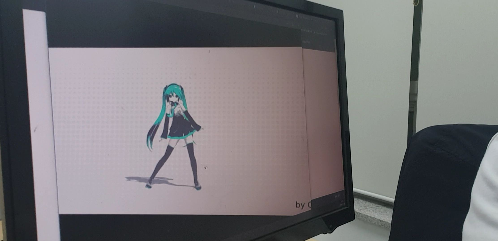

# 관찰자의 위치에 무관한 3차원 영상의 2차원 표현에 대한 탐구
이번에 교내 학술제에 나가게 되어 그 출품작으로 아래와 같은 간단한 프로그램을 작성해봤습니다. 다른 분들이 낸 연구계획서를 보니 다들 너무 잘 하셔서 이번에 상을 타긴 글렀다는 생각이 듭니다. 처음 참가해보는 것에 의의를 두도록 하겠습니다 :)
## 요약
- 일반적으로 2차원상의 화면에 3차원을 표현하는 방법은 원근법을 사용하여 그림을 그리는 것이며, 컴퓨터 그래픽스 분야에서는 동일한 원리로 projection transfrom을 사용하여 화면에 표현하게 된다. 그런데 일반적으로 사용되는 변환 방법들은 영상을 보는 사람이 영상을 마주본다는 조건 하에서 사용된다. 따라서 보는 각도가 달라지면 왜곡된 영상을 얻게 된다. 본 프로젝트에서는 어떤 관측 각도에서도 사용가능한 3차원 정보의 2차원 표현방법을 탐구해보았다. 
## 사용 방법
1. 웹캠을 연결하거나, 혹은 웹캠이 모니터에 붙어 있는 노트북이라면 다중 모니터 등을 사용하여, 컴퓨터에 연결된 카메라가 컴퓨터 자신의 화면을 볼 수 있도록 한다.
2. 프로그램을 실행하면 웹캠의 내용을 그대로 보여주는 창이 뜨는데, 이 창 속에서 다시 이 창이 보여야 한다. 즉, 웹캠을 보여주는 창의 네 모서리가 모두 카메라에 촬영되도록 카메라의 위치를 조정한다. 다음 단계에서 색을 사용한 인식을 할 것이므로, 각도에 따라 색이 변하는 LCD 모니터의 경우 각도가 너무 크면 좋지 않다.
3. 'Q'키를 누르면 화면의 상하좌우의 네 모서리에 붉은 점이 나타나면서 자동으로 카메라의 위치를 인식한다. 그러므로 카메라의 범위 내에 붉은 오브젝트가 있으면 좋지 않다. 만약 화면이 가리는 등의 이유로 붉은 점을 검출할 수 없는 경우에는 웹캠 화면을 띄우고 프로그램을 정지한다. 이 경우 아무 키나 누르면 프로그램이 꺼진다. 두 번째 단계로 돌아가 다시 웹캠의 위치를 조정해주면 된다.
4. sample.mp4 파일을 웹캠의 시점에서 봤을 때 왜곡이 없도록 하여 재생한다. 웹캠의 위치에 스마트폰 카메라를 가져가 확인해볼 수 있다.
## 결과
- 아래 이미지는 위 프로그램을 통하여 이미지를 표시한 것이다. 마치 이미지가 공중에 떠있는 것처럼 보인다.
- 
아래는 또한 어떤 영상을 위 알고리즘을 통하여 표시한 것이다. 비스듬한 각도에서 영상을 보고 있음에도 영상에 왜곡이 전혀 없어 마치 정면에서 영상이 재생되는 것 같은 느낌을 받을 수 있다.
- 