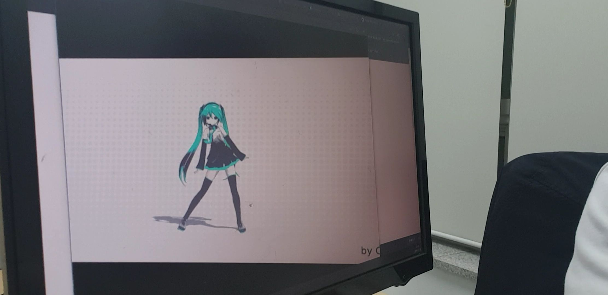

# 관찰자의 위치에 무관한 3차원 영상의 2차원 표현에 대한 탐구

## 요약
- 일반적으로 2차원상의 화면에 3차원을 표현하는 방법은 원근법을 사용하여 그림을 그리는 것이며, 컴퓨터 그래픽스 분야에서는 동일한 원리로 projection transfrom을 사용하여 화면에 표현하게 된다. 그런데 일반적으로 사용되는 변환 방법들은 영상을 보는 사람이 영상을 마주본다는 조건 하에서 사용되므로 보는 각도가 달라지면 왜곡된 영상을 얻게 된다. 본 프로젝트에서는 어떤 관측 각도에서도 사용가능한 3차원 정보의 2차원 표현방법을 탐구해보았다. 

# 1. 무엇을 개발하였는가?
## 기존 연구 : 삼차원 정보를 애초에 카메라 위치를 고려하여 렌더링

#### 기존 연구의 단점
- 카메라 위치가 바뀔 때마다 매번 새로 렌더링해야 한다.(컴퓨팅 파워가 많이 필요)

- 일반적인 영상에는 적용이 불가능하고, 삼차원 위치 정보가 담긴 특수한 경우에만 가능하다.
- 카메라 위치를 수동으로 입력해야만 하므로 응용이 어렵다.

## 단점을 보완한 새로운 연구

#### 연구 내용
- 애초에 영상이 삼차원 공간상에 존재한다고 가정하고, 이전 연구의 방법을 적용하였다.
- 카메라와 모니터의 위치관계를 반자동적으로 파악, 완전 자동화의 가능성 제시하였다.

# 1. 왜 이 연구를 시작하였는가?
- 본래 삼차원을 이차원에 표현하는 것은 관찰자가 똑바로 화면을 바라보는 경우가 대부분이었다. 왜냐하면 화면이 정면에서 너무 비틀어진 경우, 인간은 눈의 양안시차로도 3차원 정보를 인식하므로 원근법을 잘 사용하더라도 평면임이 쉽게 인지되었기 때문이다. 그러나 3D기술의 급속한 발달로 인해 양안시차까지 극복이 가능해졌고, 반대로 더 실감나는 삼차원 영상을 구현할 수 있게 되면서 화면의 위치에 무관하게 영상을 표현할 수 있는 방법이 유의미해졌다.

# 2. 본 연구의 필요성
- 영화관 등에서 위치에 관계 없이 일관적인 경험을 제공할 수 있다.

- 본 기술은 좁은 방 안, 교실 등 어디서든 사용가능하므로 공간효율성의 극대화가 가능하다.
- 게임 등 사용자와 상호작용하는 콘텐츠를 즐길 때, 사용자가 조금 움직이더라도 일관되게 화면을 표시하므로 더 몰입하여 컨텐츠를 즐길 수 있다.

# 3. 본 연구의 응용 분야
- 본 기술은 기본적으로 일반적인 모니터로 관찰하는 영상에 적용되는 것이지만, 눈에 바로 착용하는 VR, Screen-X, Home theater 등 2차원 평면 위에 표현되는 영상에 대해 모두 적용가능하다. 특히 추가적인 연구가 필요한 VR이나 Screen-X와 다르게, Home theater의 경우 바로 기술 적용이 가능하여 기술의 응용이 기대된다.

# 4. 향후 개선 방안
- 3D기술이 많이 발달하였으나, 아직 여러 사람에게 서로 다른 영상을 동시에 보여주는 것은 아직 불가능하다. 따라서 영화관 등에서 본 기술을 적용하는 데 무리가 있으며, 이런 응용을 위해서는 여러 사람에게 서로 다른 영상을 보여주는 방법이 필요하다.

- 본 연구에서 제시된 자동 정렬 방법은 관찰자의 시점에서 스크린의 위치를 파악하는 것이므로 실제 응용을 위해서는 관찰자가 이를 위한 장치를 착용해야 한다. 그러나 외부 기기에서 스크린과 관찰자의 위치를 동시에 파악하는 기술을 적용한다면, 관찰자는 3D안경 등의 가벼운 장치만으로도 본 기술을 사용할 수 있다.

# 5. 본 프로그램의 사용 방법
1. 웹캠을 연결하거나, 혹은 웹캠이 모니터에 붙어 있는 노트북이라면 다중 모니터 등을 사용하여, 컴퓨터에 연결된 카메라가 컴퓨터 자신의 화면을 볼 수 있도록 한다.

2. 프로그램을 실행하면 웹캠의 내용을 그대로 보여주는 창이 뜨는데, 이 창 속에서 다시 이 창이 보여야 한다. 즉, 웹캠을 보여주는 창이 최대한 많이 카메라에 촬영되도록 카메라의 위치를 조정한다. 다음 단계에서 색을 사용한 인식을 할 것이므로, 각도에 따라 색이 변하는 LCD 모니터의 경우 각도가 너무 크면 좋지 않다.
2. 화면에서 웹캠의 촬영 범위 안에 있는 부분들 중 아무 네 곳이나 골라 클릭한다. 이 네 점은 서로 멀리 떨어져있을수록 좋다.
3. 'Q'키를 누르면 화면에 붉은 점들이 나타나면서 자동으로 카메라의 위치를 인식한다. 그러므로 카메라의 범위 내에 선명한 붉은 색의 오브젝트가 있으면 안 된다. 만약 화면이 가리는 등의 이유로 붉은 점을 검출할 수 없는 경우에는 웹캠 화면을 띄우고 프로그램을 정지한다. 이 경우 아무 키나 누르면 프로그램이 꺼진다. 두 번째 단계로 돌아가 다시 웹캠의 위치를 조정해주면 된다.
4. sample.mp4 파일을 웹캠의 시점에서 봤을 때 왜곡이 없도록 하여 재생한다. 웹캠의 위치에 스마트폰 카메라를 가져가 확인해볼 수 있다.

---

이번에 교내 학술제에 나가게 되어 그 출품작으로 위와 같은 간단한 프로그램을 작성해봤습니다. 다른 분들이 낸 연구계획서를 보니 다들 너무 잘 하셔서 이번에 상을 타긴 글렀다는 생각이 듭니다. 처음 참가해보는 것에 의의를 두도록 하겠습니다 :)
